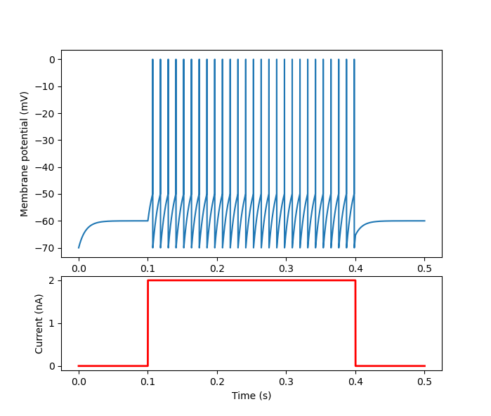

# C11 - CompModNeuPlast

This repository contains the code and the results of the simulations ran as part of the course:

<p>
  <i>
  C11 - Computational Modeling of Neuronal Plasticity <br>
  Interdisciplinary Neuroscience Master<br>
  Goethe University Frankfurt<br>
  </i>
</p>

Supervisor: [Prof. Dr. Jochen Triesch](https://www.fias.science/en/neuroscience/research-groups/jochen-triesch/)


# Contents of the repository

## 📂 neurosim

In this directory there is a single file `neurosim.py` which contains all the classes needed to run the exercises

## 📂 exercises

In this directory are all the scripts used to generate the figures for the exercises

## 📂 results

In this directory are all the figures generated with the scripts in the folder exercises

# 

#

# How to use `neurosim`

The process of simulating neurons is achieved in 4 steps:
1. **Generation of a neuron** with the desired properties, using the `Neuron` class
2. **Generation of a stimulus** to be applied to the neuron, using the `Stimulus` class
3. **Generation of a simulation** object, with all the parameters needed to run it, using the `Simulation` class
4. **Run the simulation** with the given parameters

## Usage

Here is an example for simulating a simple LIF neuron with constant current input

First, the right classes are imported

```python
from neurosim.neurosim import Neuron, Stimulus, Simulation
from matplotlib import pyplot as plt

```

Next, the neuron is created using the `Neuron` object-constructor, to which we can pass as arguments the desired parameters for the neuron. Note that only the `type` argument is mandatory. If the other parameters are omitted, the default values will be used. Here is where you can add synaptic inputs (excitatory and inhibitory) and firing adaptation mechanisms (SRA, refractory periods).

```python
# Create simple LIF neuron
lif = Neuron(type='lif',
             E_leak= -60,
             R_m=10,
             tau_m=10)
```

Next, we can create the stimulus that we will pass onto the neuron. We will create a `stim_type = 'constant'` current input at `I_ext = 2.0` which begins at `stim_start = 100 ms` after the start of the simulation and lasts 300 ms (`stim_end = 400 ms`). It is important to define here the length of the simulation `t_sim = 500 ms`, which will then be also used by the `Simulation` object that we will create next.

```python
# Create constant step current stimulus
stim = Stimulus(stim_type='constant',
                neuron=lif,
                I_ext=2.0,
                stim_start = 100, 
                stim_end=400,
                t_sim = 500, 
                dt=0.1)
```

Finally, we can create and run the `Simulation` object by passing it the neuron and the input stimulus we have just created. Once created the simulation can be run with a simple command.

```python
# Create simulation
sim = Simulation(neuron=lif,
                 stimulus=stim)

# Run simulation
sim.simulate()

```

Once the simulation has run, we can access the parameters, results, and the statistics describing the current simulation, as well as plot them.

```python
# Print simulation parameters
sim.print_sim_parameters()

# Print simulation statistics
sim.print_sim_stats()

# Plot membrane potential
sim.plotVoltageTrace(show=True)

```

<p align="center"> 

</p>

