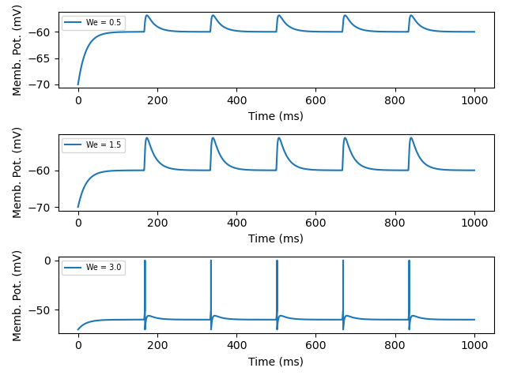
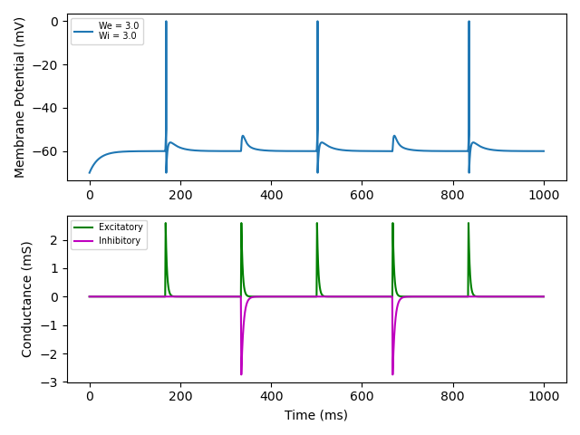

# Results

## Exercise 1.1 - Leaky IF

In this exercise I simulated a LIF neuron receiving constant current input. 

Increasing the current amplitude increases the firing rate of the neuron.

<p align="center">

</p>

The parameters used were:
```python
# Neuron parameters
E_leak = -60         # Reversal potential       (mV)
tau_m = 20           # Membrane time constant   (ms)    --> Rm*Cm [implicit]
R_m = 10             # Membrane resistance      (Mohm)
currents = [2.0,4.0] # Injected currents        (nA)

# Spiking parameters
V_spike = 0         # Spike amplitude       (mV)
V_reset = -70       # Reset potential       (mV)
V_theta = -50       # Threshold potential   (mV)
V_init = V_reset    # Initial potential     (mV)
```


## Exercise 1.2 - Leaky IF with periodic synaptic inputs

In this exercise, I first simulated a LIF neuron receiving a single excitatory synaptic input.

By increasing the strength of the synapse, we can get the neuron to reach the threshold and fire.

<p align="center">

</p>

Parameters used:
```python
# Neuron parameters
E_leak = -60         # Leak reversal potential  (mV)
tau_m = 20           # Membrane time constant   (ms)    --> Rm*Cm [implicit]

# Excitatory input parameters
E_ex    = 0     # Reversal potential    (mV)
tau_e   = 3     # Time constant         (ms)
w_ex    = 3.0   # Synapse strength      (--)
f_ex    = 6     # Input frequency       (Hz)
t_ex    = 1     # Stimulus duration     (ms)
```

Then, I simulated a LIF neuron receiving two synaptic inputs, an inhibitory and an excitatory one.

If the two synapses have the same strength, and if the neuron receives simultaneous inputs from both, firing is inhibited.

<p align="center">

</p>

Parameters used:
```python
# Neuron parameters
E_leak = -60         # Leak reversal potential  (mV)
tau_m = 20           # Membrane time constant   (ms)    --> Rm*Cm [implicit]

# Excitatory input parameters
E_ex    = 0     # Reversal potential    (mV)
tau_e   = 3     # Time constant         (ms)
w_ex    = 3.0   # Synapse strength      (--)
f_ex    = 6     # Input frequency       (Hz)
t_ex    = 1     # Stimulus duration     (ms)

# Inhibitory input parameters
E_in    = -80   # Reversal potential    (mV)
tau_i   = 5     # Time constant         (ms)
w_in    = 3.0   # Synapse strength      (--)
f_in    = 3    # Input frequency       (Hz)
t_in    = 1     # Stimulus duration     (ms)

# Reset potential parameters
V_spike = 0         # Spike amplitude       (mV)
V_reset = -70       # Reset potential       (mV)
V_theta = -50       # Threshold potential   (mV)
V_init = V_reset    # Initial potential     (mV)
```

⚠️ Note that here the synaptic conductance reaches values of maximum +-2 mS , while in the lecture notes the range is +100 -50. Maybe the figure was created with different parameters? ⚠️

## Exercise 1.3 - Integration Time Step

Euler integration is used to numerically solve the differential equations describing the evolution of neuronal activity.

The accuracy of Euler's method is dependent on the time step size `dt` chosen to move forward in time.

In this exercise, I find the *analytical solution* for the synaptic conductance, as well as the *numerical solution(s)* with different values of `dt`.

Smaller values of `dt` produce more accurate results.

<p align="center">

</p>


## Exercise 1.4 - Poisson spike train

For this exercise, a function generating (homogeneous) Poisson spike trains was created and was used as an input for the LIF neuron.

Furthermore, the LIF neuron was expanded to allow for an arbitrary number of excitatory and inhibitory neurons.

The neuron was simulated with 10 excitatory and 10 inhibitory input synapses, for a total of 10 s across 10 trials. 

The firing rate was increased from 10 Hz to 100 Hz.

The histograms of the *inter-spike-intervals* (**ISI**) and of the *coefficient of variation* (**CV**) are generated (still doesn't function perfectly), to check for input irregularity.


<p align="center">
  
  
  
  
  
</p>

Only when the expected firing rate is increased to at least 75 Hz do we begin approaching a CV of 1.

parameters used were:
```python
# Neuron parameters
E_leak = -60         # Leak reversal potential  (mV)
tau_m = 20           # Membrane time constant   (ms)    --> Rm*Cm [implicit]

# Excitatory input parameters
E_ex    = 0     # Reversal potential    (mV)
tau_e   = 3     # Time constant         (ms)
w_ex    = 3.0   # Synapse strength      (--)
t_ex    = 1     # Stimulus duration     (ms)
# Poisson spiking
f_ex    = 10  # Firing rate           (Hz) THIS ONE VARIES

# Inhibitory input parameters
E_in    = -80   # Reversal potential    (mV)
tau_i   = 5     # Time constant         (ms)
w_in    = 3.0   # Synapse strength      (--)
t_in    = 1     # Stimulus duration     (ms)
# Poisson spiking
f_in    = 10   # Firing rate           (Hz) THIS ONE VARIES

# Reset potential parameters
V_spike = 0         # Spike amplitude       (mV)
V_reset = -70       # Reset potential       (mV)
V_theta = -50       # Threshold potential   (mV)
V_init = V_reset    # Initial potential     (mV)
```


⚠️ This part is still work in progress. The parameters used here are different than the one mentioned in the paper and if I use the same, I do not get the same results. Also the code is somewhat unstable at the moment. ⚠️

