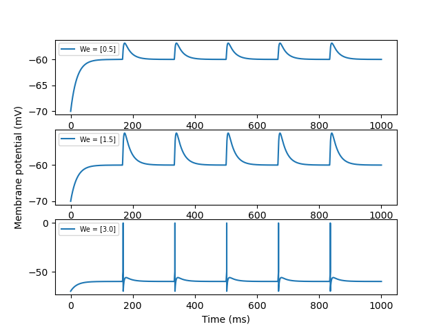
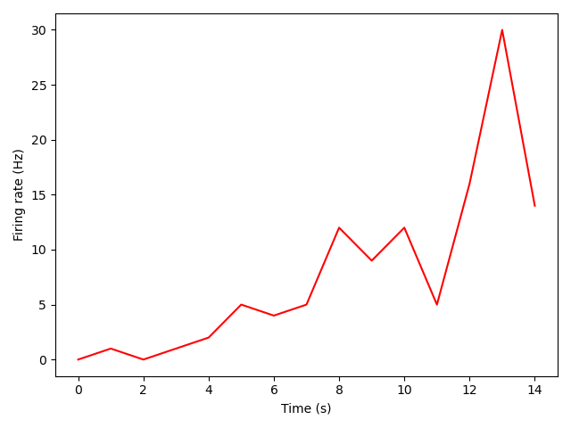
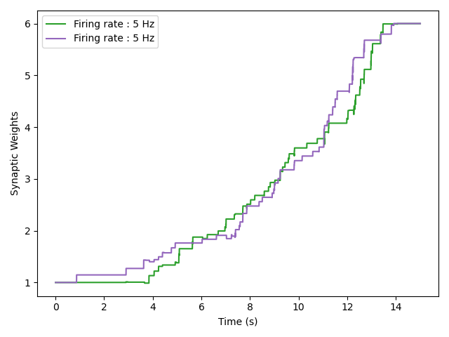
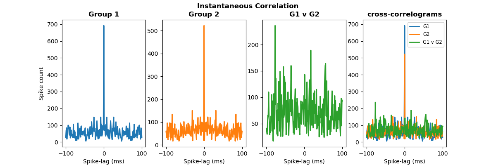

# Results

# Chapter 1

## 1.1 Leaky Integrate-and-Fire

In this exercise I simulated a LIF neuron receiving constant current input.

Increasing the current amplitude (from `I = 2.0 nA` to `I = 4.0 nA`) increases the firing rate of the neuron.

## 1.2 Periodic synaptic inputs

In the first part of this exercise, I simulated a LIF neuron for `t = 1 s` receiving a single <ins>**excitatory**</ins> synaptic input arriving **_periodically_** with a frequency of `r = 5 Hz`.

The excitatory synaptic strength was first set to `We = 0.5`, which was not enough to reach the firing threshold in the neuron.

Subsequently, the synaptic strength was increased to `We = 1.5` and to  `We = 3.0`. Only the latter was strong enough to elicit firing in the neuron.

In the second part of the exercise, I added a second <ins>**inhibitory**</ins> synaptic input, arriving periodically with a frequency of `r = 3 Hz`.

Both excitatory and inhibitory synaptic weights were set to `We = Wi = 3.0`.

When the neuron received excitatory input only, it was able to emit a spike. When both excitatory and inhibitory stimuli arrived at the same time, an EPSP was observable but spike firing was inhibited.

## 1.3 Integration time-step

Euler integration was used to numerically solve the differential equations describing the evolution of neuronal activity.

The accuracy of Euler's method is dependent on the time step size `dt` chosen to move forward in time.

In this exercise, I compute the *analytical solution* for the synaptic conductance, as well as its *numerical solution(s)* with different values of `dt`.

As expected, smaller values of `dt` produce more accurate results.

## 1.4 Poisson spike trains

In this exercise I simulated a LIF neuron receiving  **_Poisson spike trains_** with constant firing rate `r = 10 Hz` (homogeneous Poisson process) as inputs to its `Ne = 10` excitatory synapses and to its `Ni = 10` inhibitory synapses. 

The neuron was simulated for `n = 50` trials, lasting `t = 10` seconds each. 

The **_inter-spike-intervals (ISI)_** were measured and their **_coefficient of variation (CV)_** was computed for each trial, together with the **_firing rate_**.   

The **distribution of ISIs** was plotted and an exponential function was fitted to it. 

The **distribution of the CVs** was also plotted and its mean calculated. 

---
One would expect that, when the Excitatory and Inhibitory inputs are balanced, the neuron would fire in accordance with the Poisson process statistics.

Therefore, one would expect the ISI to be exponentially distributed, and the CV to be close to 1. 

Furthermore, one would expect the _measured_ firing rate to be equal to around **half** of the _expected_ firing rate, given the equal contribution of excitatory and inhibitory inputs.
___

First, the synaptic strengths were set to `We = Wi = 0.5` for all synaptic inputs. 

The inter-spike-intervals were indeed exponentially distributed, however the mean CV was equal to `CV = 0.888`. 

The average firing rate was found to be lower (`r = 3.4 Hz`) than the expected value (`r = 10/2 = 5 Hz`).

These results _(figure below, graph on the left)_ suggest that the excitatory and inhibitory inputs are not balanced, with more weight given to inhibitory inputs. 
This can be explained by the fact that, in this model, the inhibitory synaptic currents are slower to decay than the 
excitatory ones, as indicted by their different time constants (`Ti = 5 ms > Te = 3 ms`). 

This implies that, if the neuron receives an excitatory and inhibitory stimuli simultaneously, and both synaptic weights are equal,
the inhibitory stimulus will have a greater (longer-lasting) effect on the overall evolution of the membrane potential.

In order to explore the relation between excitatory synaptic weights and E-I balance, as well as to find the optimal `We` 
to reach this balance, a second experiment was performed _(figure above, graph on the right)_.

A series of 10 simulations (50 trials x 10 s each) were run, in which the excitatory synaptic weights for all excitatory
synapses was linearly increased from `We = 0.1` until `We = 1.0`, while the inhibitory synaptic weights were kept constant 
for all inhibitory synapses (`Wi = 0.5`).

As expected, the excitatory synaptic weight at which the highest balance was reached was slightly larger (`We = 0.6`) than 
the inhibitory one. 

In such a configuration of synaptic weights, the firing rate of the neuron was equal to `r = 7.0 Hz` and the mean CV was
 `CV = 0.901`, suggesting a greater balance of EI inputs.
 
 The fact that the firing rate is not exactly equal to `r = 5 Hz` is probably because the true optimal excitatory weight 
 actually sits between the two tested values: `0.5 < We_opt < 0.6`.
 
 ___
 
 To test the previous hypothesis, 10 more simulations were performed, this time with the excitatory synaptic weight 
 increasing linearly between `We = 0.5` until `We = 0.6` in steps of `dw = 0.01`.
 
 As expected, the optimal synaptic weight was found to be `We = 0.55`, which caused the neuron to spike with a firing rate
 of `r = 4.9 Hz` and a distribution of ISI with a coefficient of variation equal to `CV = 0.910`, the largest one achieved.
 
 

# Chapter 2

## 2.1 Spike-Rate Adaptation

In this exercise, I implemented a mechanism for spike-rate adaptation (SRA) in a LIF neuron. I simulated the neuron receiving a constant step current input `I_ext = 1.45` for a given amount of time. In the following graphs, one can observe the effect of SRA on the LIF neuron when it is added to the model. 

In the **first** graph the LIF is simulated **without any SRA** (`dg_sra = 0.0`) for `t_sim = 500 ms`, and a step current is applied from `stim_start = 50 ms` to `stim_end = 350 ms` . The SRA conductance is zero the entire time, and the spike frequency (inverse of the ISI for each spike) is constant all throughout the simulation

In the **second** graph the LIF is simulated **with SRA** (`dg_sra = 0.06`). The length of the simulation and the properties of the input current are the same as before. As the neuron spikes, the SRA conductance rises sharply, only to decay until the next spike is emitted. The input current is strong enough to induce sustained spiking in the neuron, so that the SRA conductance cannot decay back to `0`. Instead, the average conductance slowly grows towards its saturation point, before the step current is removed, at which point it decays back to baseline. The effect on the spiking frequency is clear: as the neuron emits more and more spikes, the inter-spike intervals get longer and longer, growing exponentially.

This is even more obvious in the **third** graph, in which the same neuron **with SRA** is simulated for a longer time period (`t_sim = 1000 ms`) and the step current is applied for longer (`750 ms`). Here, the average SRA conductance reaches its saturation point at time `t_sat ≈ 500 ms`, the same time-point at which the spiking frequency has decayed to its lowest fixed point, given the current input. After this time-point the spiking frequency will remain constant until the step current is changed.

 

## 2.2 Refractory period

In this exercise, I implemented a mechanism which models the refractory period (RP) observed in pyramidal neurons. The same 
differential equation as the one used to describe the SRA conductance governs the evolution of the RP conductance, although
the parameters are now different: `E_rp = -70` , `tau_rp = 50` , and `dg_rp = 1.2`.

The refractory period was added to a LIF neuron receiving 10 excitatory and 10 inhibitory synaptic inputs, in the same 
configuration as the one described in [Exercise 1.4](#14-poisson-spike-trains). The synaptic weights were adjusted so that,
in absence of RP, the excitatory and inhibitory inputs would be perfectly balanced (`We = 0.55` and `Wi = 0.50`).

The neuron was simulated for 50 trials of 10 seconds each, the ISI were determined, and their CV was computed. 

The distributions of both ISI and CV are plotted in the graph below. If compared to the result from Exercise 1.4 with the 
same [synaptic weights](#balanced-weights), it can be clearly seen that, after addition of the refractory period, the spiking becomes a lot more
regular, as indicated by the average CV being smaller (`CV = 0.656`), by the ISI distribution which looks less exponential than
in the RP-free case, and by the firing rate being smaller (`r = 3.4 Hz`) than the one expected (`r_exp = 5 Hz`).

 

# Chapter 3

## 3.1 Spike-Timing Dependent Plasticity

In this exercise I implemented a mechanism for Spike-Timing Dependent Plasticity (STDP, in which the weight of each synaptic input was governed by the following differential equation:

`dw[t]/dt  = A_ltp*X[t]*d[t-t_pre] + A_ltd*Y[t]*d[t-t_post]`

where `X[t]` and `Y[t]` are the spike traces for the pre- and post-synaptic neurons, respectively, as described in [Morrison et al., 2008](https://doi.org/10.1007/s00422-008-0233-1), and `d[*]` is the Dirac's delta function. 

STDP was added to a traditional LIF neuron, receiving `N_exc = 2` excitatory synapses and no inhibitory ones. The two excitatory synapses had equal initial weights (`w_exc = 1.0`). The LTP amplitude was set to `A_ltp = 0.1` and the LTD amplitude was set to `A_ltd = -0.05`. Time constants for LTP and LTD were set to `tau_ltp = 17 ms` and `tau_ltd = 34 ms`.

The neuron was simulated for `t_sim = 15` seconds, while receiving poisson distributed inputs from both pre-synaptic neurons, with expected firing rate `rate_exc = 5 Hz` for both.

 

In a second experiment the expected firing rate of one of the synapses was increased to `rate_exc[0] = 8 Hz` while the other one remained at `rate_exc[1] = 5 Hz`. 

 

## 3.2 Correlated Spike Trains

In this exercise I implemented a function to generate time-correlated spike trains. The procedure follows the algorithm presented _method 2_ of [Brette, 2008](http://romainbrette.fr/WordPress3/wp-content/uploads/2014/06/Brette2008NC.pdf). Briefly, a Poisson-distributed `source_train` is generated as [before](#3.2-Correlated-Spike-Trains). Next, each spike is copied to a `new_train`, with a probability of `p = sqrt(c)`, where `c` is the desired correlation between spike trains. In order to make up for the loss of firing rate caused by the thinning, another `noise_train` is generated with rate `r = r_source*(1-p)`, and it is combined with the `new_train` to generate the `final_train`. The method described generates instantaneous (`'inst'`) correlation between spike trains. I also implemented the possibility to generate exponentially (`'exp'`) correlated spike trains. To achieve this each new spike was jittered by an exponentially distributed random amount.

I also implemented a method to compute and plot the cross-correlogram between 2 or more spike trains. It follows the method described in [Dayan and Abbot, 2007](http://www.gatsby.ucl.ac.uk/~lmate/biblio/dayanabbott.pdf).

I created two groups of 10 _instantaneously_ correlated Poisson spike trains, with correlation `c = 0.3`, firing rate `r = 10 Hz` and duration `t_stim = 10 s`. The cross-correlograms `'within'` each group show that, indeed, for the majority of the spike pairs in the 10 spike trains, the lag between them is equal to zero, indicating that they are firing synchronously. When the cross-correlation is however computed `'between'` Group 1 and Group 2, no correlation was found, as evidenced by the lack of a peak at zero-lag.

 

When the same experiment was repeated with 2 groups of 10 _exponentially_ correlated spike trains, similar results occurred: Correlation within groups showed a peak at the zero-lag, which however did not decline sharply but which decayed exponentially, as expected. Once again, correlation between-groups was absent.

 

## 3.3 

# Chapter 4

# Chapter 5
