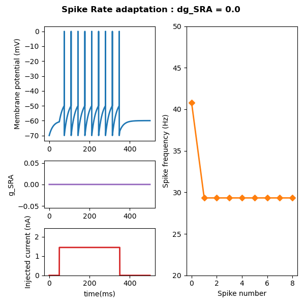
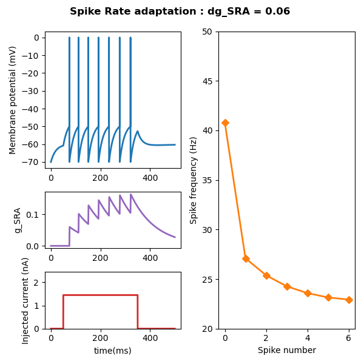
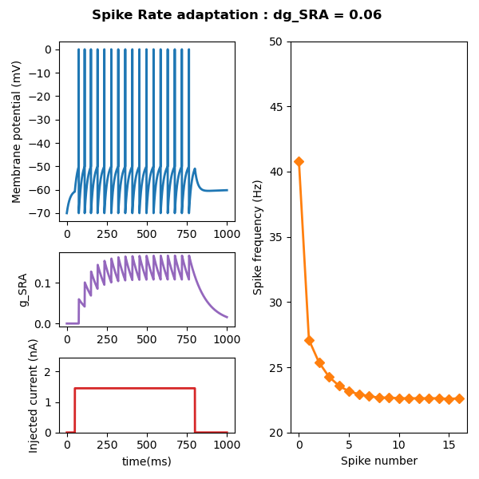
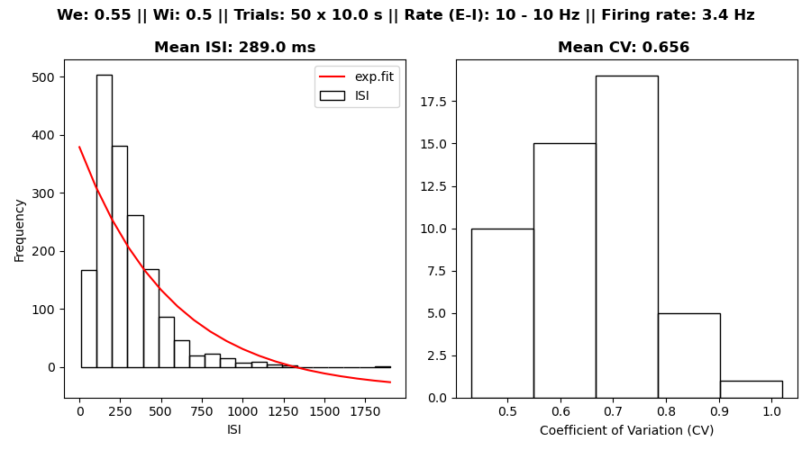

# Results

# Chapter 2

## 2.1 Spike-Rate Adaptation

In this exercise, I implemented a mechanism for spike-rate adaptation (SRA) in a LIF neuron. I simulated the neuron receiving a constant step current input `I_ext = 1.45` for a given amount of time. In the following graphs, one can observe the effect of SRA on the LIF neuron when it is added to the model. 

In the **first** graph the LIF is simulated **without any SRA** (`dg_sra = 0.0`) for `t_sim = 500 ms`, and a step current is applied from `stim_start = 50 ms` to `stim_end = 350 ms` . The SRA conductance is zero the entire time, and the spike frequency (inverse of the ISI for each spike) is constant all throughout the simulation

In the **second** graph the LIF is simulated **with SRA** (`dg_sra = 0.06`). The length of the simulation and the properties of the input current are the same as before. As the neuron spikes, the SRA conductance rises sharply, only to decay until the next spike is emitted. The input current is strong enough to induce sustained spiking in the neuron, so that the SRA conductance cannot decay back to `0`. Instead, the average conductance slowly grows towards its saturation point, before the step current is removed, at which point it decays back to baseline. The effect on the spiking frequency is clear: as the neuron emits more and more spikes, the inter-spike intervals get longer and longer, growing exponentially.

This is even more obvious in the **third** graph, in which the same neuron **with SRA** is simulated for a longer time period (`t_sim = 1000 ms`) and the step current is applied for longer (`750 ms`). Here, the average SRA conductance reaches its saturation point at time `t_sat ≈ 500 ms`, the same time-point at which the spiking frequency has decayed to its lowest fixed point, given the current input. After this time-point the spiking frequency will remain constant until the step current is changed.

 

## 2.2 Refractory period

In this exercise, I implemented a mechanism which models the refractory period (RP) observed in pyramidal neurons. The same 
differential equation as the one used to describe the SRA conductance governs the evolution of the RP conductance, although
the parameters are now different: `E_rp = -70` , `tau_rp = 50` , and `dg_rp = 1.2`.

The refractory period was added to a LIF neuron receiving 10 excitatory and 10 inhibitory synaptic inputs, in the same 
configuration as the one described in [Exercise 1.4](#14-poisson-spike-trains). The synaptic weights were adjusted so that,
in absence of RP, the excitatory and inhibitory inputs would be perfectly balanced (`We = 0.55` and `Wi = 0.50`).

The neuron was simulated for 50 trials of 10 seconds each, the ISI were determined, and their CV was computed. 

The distributions of both ISI and CV are plotted in the graph below. If compared to the result from Exercise 1.4 with the 
same [synaptic weights](#balanced-weights), it can be clearly seen that, after addition of the refractory period, the spiking becomes a lot more
regular, as indicated by the average CV being smaller (`CV = 0.656`), by the ISI distribution which looks less exponential than
in the RP-free case, and by the firing rate being smaller (`r = 3.4 Hz`) than the one expected (`r_exp = 5 Hz`).

 

# Go back to:

[Chapter 1 : Leaky Integrate-and-Fire](https://github.com/rtam97/C11-CompModNeuPlast/blob/main/results/unit1/README.md)

[Chapter 2 : Adaptations in Spiking Behavior](https://github.com/rtam97/C11-CompModNeuPlast/blob/main/results/unit2/README.md)

[Chapter 3 : Spike-Timing Dependent Plasticity](https://github.com/rtam97/C11-CompModNeuPlast/blob/main/results/unit3/README.md)

[Chapter 4: Synaptic Homeostasis](https://github.com/rtam97/C11-CompModNeuPlast/blob/main/results/unit4/README.md)

[Chapter 4: Short-Term Plasticity](https://github.com/rtam97/C11-CompModNeuPlast/blob/main/results/unit5/README.md)
