# Results

# Chapter 3

## 3.1 Spike-Timing Dependent Plasticity

In this exercise I implemented a mechanism for Spike-Timing Dependent Plasticity (STDP, in which the weight of each synaptic input was governed by the following differential equation:

`dw[t]/dt  = A_ltp*X[t]*d[t-t_pre] + A_ltd*Y[t]*d[t-t_post]`

where `X[t]` and `Y[t]` are the spike traces for the pre- and post-synaptic neurons, respectively, as described in [Morrison et al., 2008](https://doi.org/10.1007/s00422-008-0233-1), and `d[*]` is the Dirac's delta function. 

---

STDP was added to a traditional LIF neuron, receiving `N_exc = 2` excitatory synapses and no inhibitory ones. The two excitatory synapses had equal initial weights (`w_exc = 1.0`). The LTP amplitude was set to `A_ltp = 0.1` and the LTD amplitude was set to `A_ltd = -0.05`. Time constants for LTP and LTD were set to `tau_ltp = 17 ms` and `tau_ltd = 34 ms`.

The neuron was simulated for `t_sim = 15` seconds, while receiving poisson distributed inputs from both pre-synaptic neurons, with expected firing rate `rate_exc = 5 Hz` for both.

 
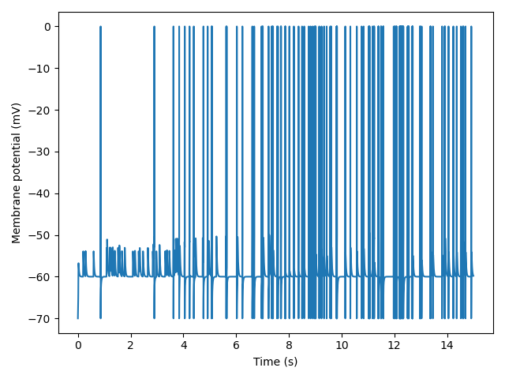
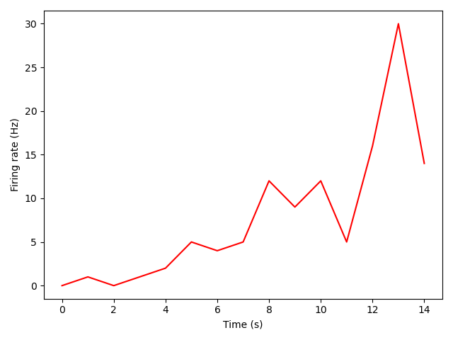
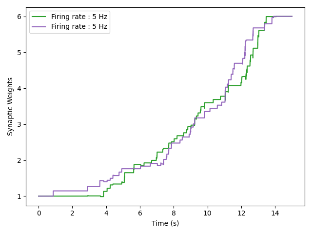

---

In a second experiment the expected firing rate of one of the synapses was increased to `rate_exc[0] = 8 Hz` while the other one remained at `rate_exc[1] = 5 Hz`. 

 
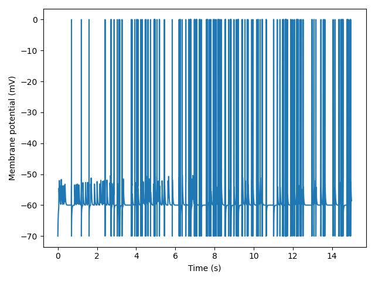
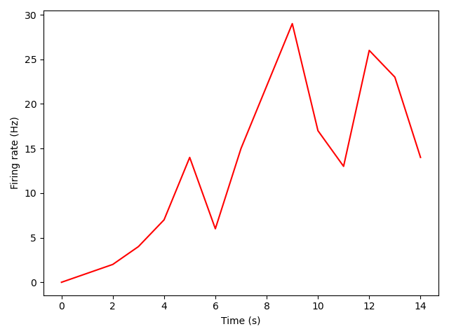
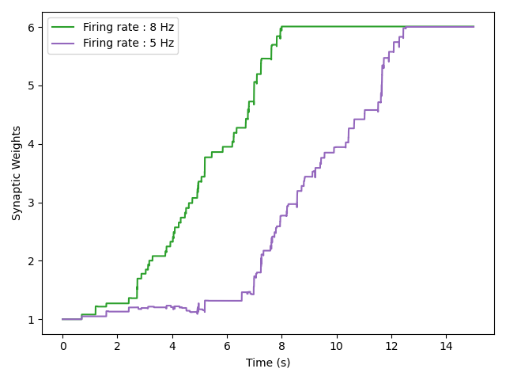

## 3.2 Correlated Spike Trains

In this exercise I implemented a function to generate time-correlated spike trains. The procedure follows the algorithm presented _method 2_ of [Brette, 2008](http://romainbrette.fr/WordPress3/wp-content/uploads/2014/06/Brette2008NC.pdf). Briefly, a Poisson-distributed `source_train` is generated as [before](#3.2-Correlated-Spike-Trains). Next, each spike is copied to a `new_train`, with a probability of `p = sqrt(c)`, where `c` is the desired correlation between spike trains. In order to make up for the loss of firing rate caused by the thinning, another `noise_train` is generated with rate `r = r_source*(1-p)`, and it is combined with the `new_train` to generate the `final_train`. The method described generates instantaneous (`'inst'`) correlation between spike trains. I also implemented the possibility to generate exponentially (`'exp'`) correlated spike trains. To achieve this each new spike was jittered by an exponentially distributed random amount.

I also implemented a method to compute and plot the cross-correlogram between 2 or more spike trains. It follows the method described in [Dayan and Abbot, 2007](http://www.gatsby.ucl.ac.uk/~lmate/biblio/dayanabbott.pdf).

---

I created two groups of 10 _instantaneously_ correlated Poisson spike trains, with correlation `c = 0.3`, firing rate `r = 10 Hz` and duration `t_stim = 10 s`. The cross-correlograms `'within'` each group show that, indeed, for the majority of the spike pairs in the 10 spike trains, the lag between them is equal to zero, indicating that they are firing synchronously. When the cross-correlation is however computed `'between'` Group 1 and Group 2, no correlation was found, as evidenced by the lack of a peak at zero-lag.

 
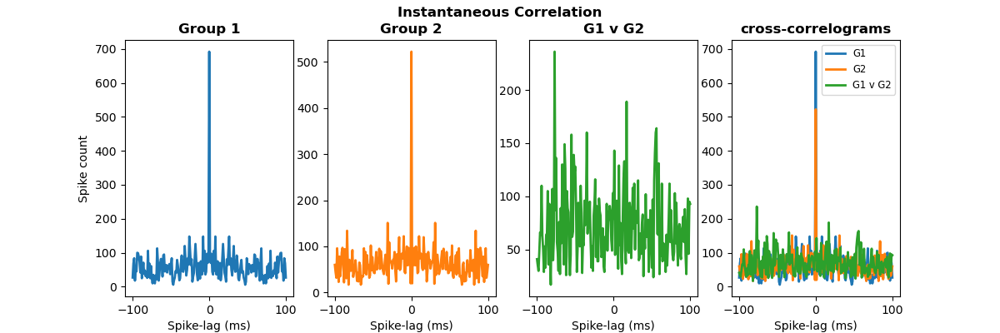

---

When the same experiment was repeated with 2 groups of 10 _exponentially_ correlated spike trains, similar results occurred: Correlation within groups showed a peak at the zero-lag, which however did not decline sharply but which decayed exponentially, as expected. Once again, correlation between-groups was absent.

 
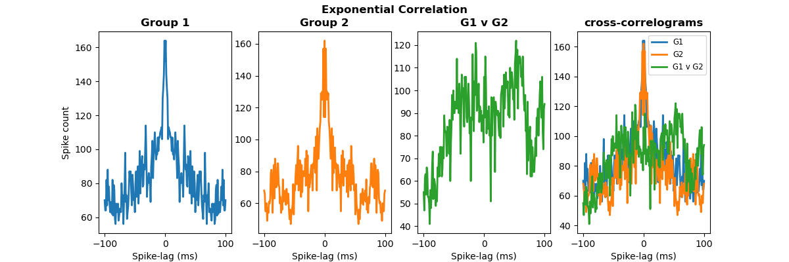

## 3.3 Correlations and STDP

In this exercise I applied the correlated stimuli from above to a LIF neuron subject to STDP 

The neuron received a total of 20 excitatory synapses, which were subject to STDP with scaling factors `A_ltp = 0.02` and `A_ltd = -0.01`, as well as 10 inhibitory synapses, which did not undergo STDP and which had a fixed strength `w_exc = 1.0`. 

Half of the excitatory synapses were stimulated with Poisson stimuli that were correlated with each other (`Group 1`), while the other half (`Group 2`) received Poisson stimuli that were also correlated with each other but uncorrelated with the stimuli belonging to Group 1. Both groups stimulated the neuron at a frequency of 10 Hz.

The imposed correlation within each group (`c1` and `c2`) as well as the initial synaptic strengths for both groups (`w1` and 'w2') were varied in a series of experiments aimed at characterizing the learning behavior of the LIF neuron under different plasticity conditions.

--- 

First, the imposed correlations as well as the initial synaptic strengths were set to be equal (`c1 = c2 = 0.1` and `w1 = w2 = 0.5`) and the neuron was simulated for `t = 30 s`.
The spike trains were _instantaneously_ correlated.

As expected, the synaptic weights of both groups grew almost identically until the maximum weights were reached. The firing rate increases as the synaptic weights grow larger. Note the flat line at `w = 1.0`, representing the unchanged inhibitory weights. There seems to be a pair of weights (one for each group) to be faster than the rest.

 
  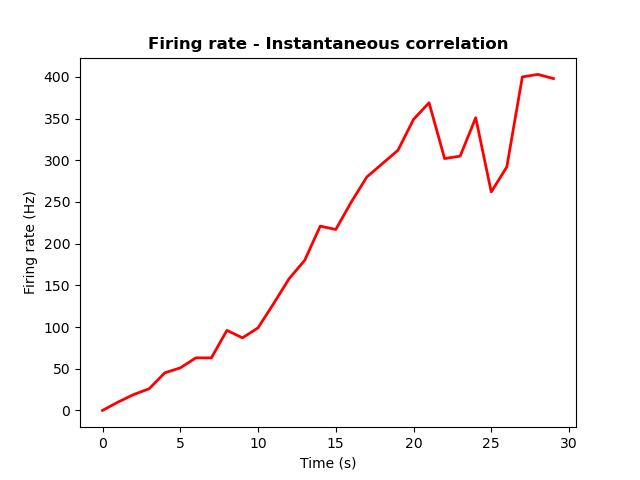
  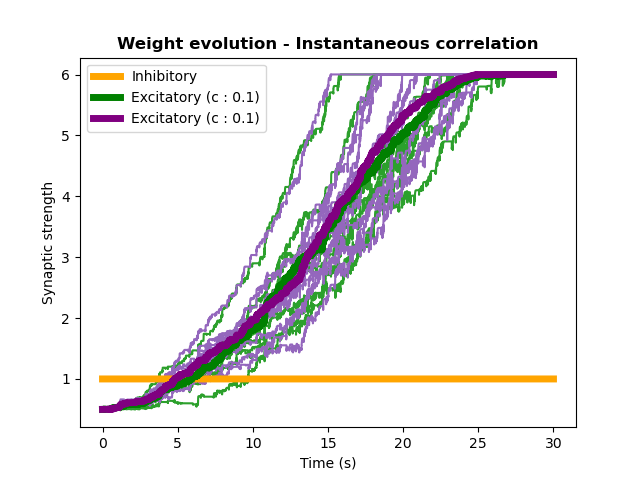

---

A similar result was obtained when stimulating the neuron with _exponentially_ correlated spike trains with equal parameters as before (**left**). 

 
  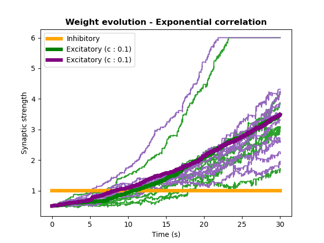
  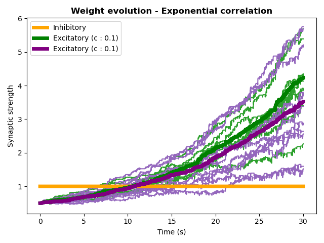

The lines depicting the average evolution of synaptic weights are almost superimposed to each other. In this case, however, on average none of the synaptic weights reached the maximum value. This is due to the fact that, because of the jittering in time, the correlation between spikes tends to be lower and consecutively the increase in weight is lower as well. However, when looking at the individual traces, it is clear that there is a pair of weights (one for each group), which grows faster than all the others and does manage to reach the maximum. This effect is an artifact and it is to be attributed to the fact that all spike trains within one group are generated from the same source train, which means that the source train will have higher chances to be correlated with the rest of them, and so have a higher chance of increasing its weight. This could be solved by using the lastly generated spike train as a source for each one that follows. 

The figure on the **right** shows the same experiment done with the new resampling procedure and shows no correlation advantage. However, the rest of the figures were generated with the former method.

--- 

Next, the correlation of the spike trains of **Group 2** was first increased to `c2 = 0.2` and then to `c2 = 0.5` while the correlation of Group 1 remained the same, in order to observe the effect that a greater correlation between spike trains has on the plasticity of the respective weights. 

The same experiment was performed on both instantaneously and exponentially correlated spike trains.

 
  
  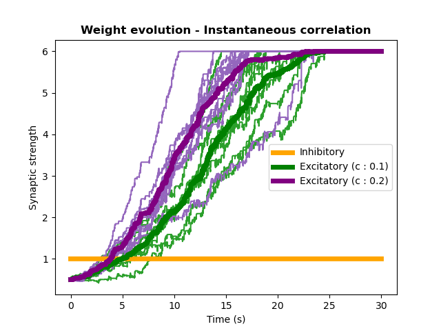
  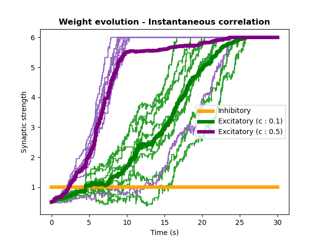

 
  
  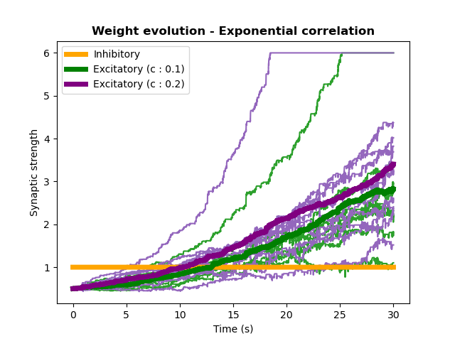
  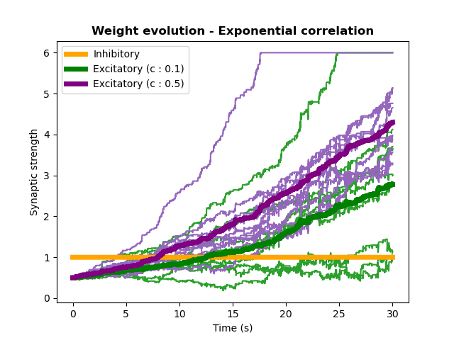

It is clear that incrementing the spike-train correlations by even 0.1 is enough to drive the neuron to increase its synaptic strength much more rapidly with the pre-synaptic neurons the fire more synchronously. This is particularly true for the instantaneously-correlated trains, while for the exponentially correlated spike-trains an increase of 0.4 points is needed to reach a substantial difference in how quickly the two groups grow. 

---

Importantly, when the initial synaptic weights are unbalanced, this mechanism described above could provide a way for the neuron to still gain connectivity to the relevant stimuli.

To test this, I simulated the same neuron, with the same stimulation parameters as above, however this time the initial weights were unbalanced, so that Group 1 started with `w1 = 1.0` while Group 2 started with `w1 = 0.5`. When the correlation within the two groups was the same (`c1 = c2 = 1.0`) the weights of the two groups grew in the same exact manner, and with the same exact speed. However, due to the initial disadvantage, _Group 2_ took longer to reach the maximum weight (**LEFT**). 

Increasing the correlation of _Group 2_ to `c2 = 0.2` was enough to rescue the disadvantage, and the two groups reached the maximum roughly at the same time (**MIDDLE**). When the correlation of _Group 2_ is increased to `0.5`, its synaptic weights grow so much faster than the ones of _Group 2_ that they reach the maximum much earlier than those of _Group 1_ (**RIGHT**). 

 
  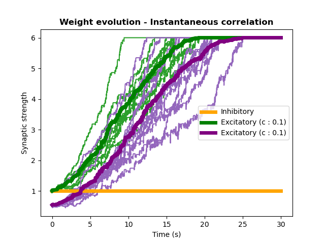
  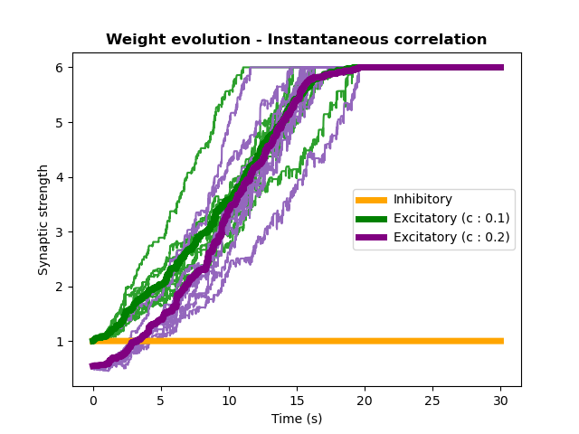
  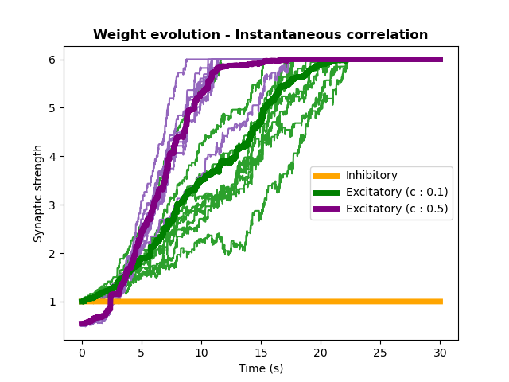

This shows that, indeed, the neuron is able to tune its synaptic weights to better tune into pre-synaptic partners which deliver more synchronous, and thus more relevantly connected, stimulations.

A similar pattern is also observed when the stimuli are correlated exponentially, albeit requiring stronger correlations to elicit a rescuing of the initial disadvantage. As can be seen, only when increasing the correlation to `c2 = 0.5` the weights grow as fast as to be able to recuperate the disadvantage, and only increasing the correlation to `c2 = 0.9` allows the weights of _Group 2_ to overtake the weights of _Group 1_. 

 
  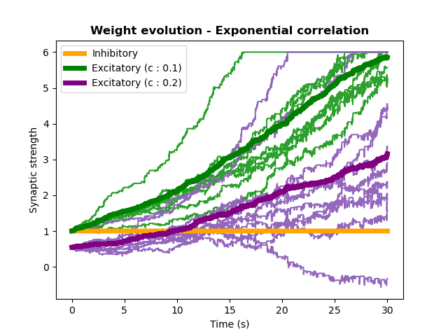
  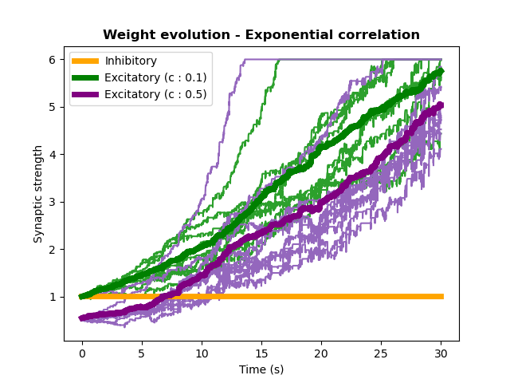
  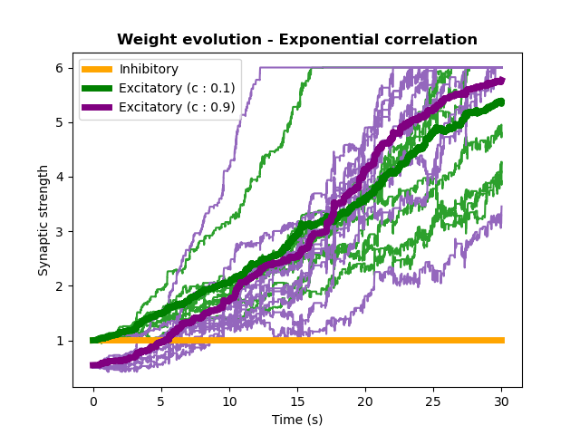

# Go back to:

[Chapter 1 : Leaky Integrate-and-Fire](https://github.com/rtam97/C11-CompModNeuPlast/blob/main/results/unit1/README.md)

[Chapter 2 : Adaptations in Spiking Behavior](https://github.com/rtam97/C11-CompModNeuPlast/blob/main/results/unit2/README.md)

[Chapter 3 : Spike-Timing Dependent Plasticity](https://github.com/rtam97/C11-CompModNeuPlast/blob/main/results/unit3/README.md)

[Chapter 4: Synaptic Homeostasis](https://github.com/rtam97/C11-CompModNeuPlast/blob/main/results/unit4/README.md)

[Chapter 4: Short-Term Plasticity](https://github.com/rtam97/C11-CompModNeuPlast/blob/main/results/unit5/README.md)

