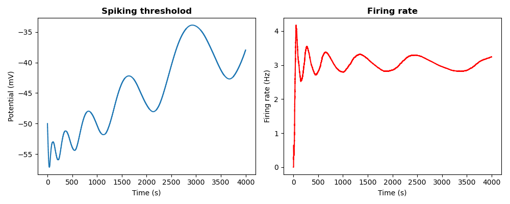

# Results

# Chapter 4 : Synaptic Homeostasis

## 4.1 Synaptic Normalization

In this exercise I implemented the homeostatic mechanism of synaptic normalization. Each weight for all excitatory and 
inhibitory synapses is (separately) adjusted every `t_norm` seconds by the following multiplicative rule:

`w(t+1) = w(t)*(1 + eta*(W_tot/sum(w) - 1))`

where `W_tot` is the maximum total allowed weight for the neuron, `sum(w)` is the sum of all (excitatory OR inhibitory) 
weights, and `eta` is the fraction of total change to apply, given the difference between `W_tot` and `sum(w)`.

Such a rule should prevent weigths from growing uncontrollably under STDP.
___

To test whether this is the case, I simulated a LIF neuron receiving 100 excitatory poisson stimuli at 10 Hz. Half of 
those stimuli (Group 1) were correlated with correlation `c1 = 0.1` and the other half (Group 2) were correlated with 
correlation `c2 = 0.2` all the excitatory weights were set to `w_exc = 0.1`. Those weights underwent STDP, with 
`A_ltp_e = 0.02 ` and ` A_ltd_e = -0.01`, as well as underwent synaptic normalization, with `eta = 0.2`. 

Multiple simulations were run, in which both the correlation type (`instantaneous` or `exponential`) and the maximum 
weight (`W_tot`) were varied.

The neuron also received 30 inhibitory poisson inputs, which were uncorrelated, 
and did not undergo neither STDP nor synaptic normalization.

The neuron was simulated for 100 seconds in all experiments. 

### Experiment 1 

Here the correlation was instantaneous (`corr_type = 'inst'`) and `W_tot = 3`.

Because each excitatory weight is initially set to `w_exc = 0.1`, the sum of all `N = 100` excitatory weights (`sum(w) = 10`) 
is much larger than the total allowed weight (`W_tot = 3`). 

Thus, we would expect the neuron to decrease all of its weights in order to bring them down to a more acceptable value. 
This is indeed occurring every time that the weights are normalized (ie: every second). 

However, given the initial synaptic weights, the large number of correlated excitatory inputs, as well 
as the slow normalization time step, we see that _STDP is able to counter-balance the normalization_ by growing the weights just enough
so that the at each normalization step the weights are lowered back by roughly the same amount they were increased by STDP (**mid-left panel**). 

This is reflected by the instantaneous firing rate, which if fairly stable around 40 Hz (**top-left panel**).

 

If we then look at the distribution of excitatory weights over time (**bottom left panel | right panels**), we see an interesting pattern. 
In the first `~20 s`, the two groups of stimuli are equally competing for synaptic resources of the post-synaptic neuron. 

However, as the neuron receives more and more highly-correlated spikes from `Group 2`, the weights for `Group 2` are increased 
faster than those for `Group 1`. This in turn causes the overall normalization factor to increase and, while the weights of 
`Group 2` are able to remain stable (given that the largest contribution to the normalization factor is theirs), the weights
for `Group 1` are not able to grow fast enough to overcome synaptic normalization (on average) and, as time progresses, 
more and more of them are driven to zero.

This shows how synaptic normalization coupled to STDP will lead a neuron to prune away the 'less inportant' (less correlated)
inputs in favor of 'more relevant' (more correlated) inputs, in the biologically realistic case of having limited resources 
to allocate towards synaptic connectivity.

### Experiment 2

Here the correlation was exponential (`corr_type = 'exp'`) and again `W_tot = 3`.

Similarly to Experiment 1, when looking at the weight distributions over time (**bottom-left panel | right panels**) the
two synaptic input groups initially equally compete for synaptic resources until about 12 
seconds, after which `Group 2` takes over `Group 1` and slowly drives it to extinction.

What is interesting to note, however, is that in the case of exponentially correlated inputs, the STDP is not able to 
overcome the synaptic normalization from the beginning. Therefore, we observe an initial decline in firing rate until it 
becomes stabilized at around 10 Hz (**top-left panel**), which is reflected by the stabilization of total excitatory synaptic weights at around 4, 
slightly above the total allowed sum of excitatory weights (**mid-left panel**).

 
  

### Experiment 3 & 4

The same experiments as before were performed, but this time the total allowed weight was increased to `w_tot = 13`, which is higher than the total sum of the initial weights (`sum(w) = 10`).

This was done in order to see whether the weights would grow towards the maximum and then settle there, grow towards the maximum and continue growing towards a new stable point, or remain bounded under the maximum weight.

One would expect that the weights grow until the maximum and then plateau at that point.

However, for both instantaneous (**left panel**) and exponential (**right panel**) correlated inputs, the weights grew towards the maximumu `W_tot` very quickly and then continued to grow further, until a further stable point was reached, much higher than the maximum allowed: ~40 for instantaneous and ~20 for exponential correlation.

This can be explained by the fact that, in order to reach the maximum from below, the neuron has to increase its overall weights, on top of STDP. Therefore, once it reaches the maximum, the weights will be so high that the STDP will greatly overcome synaptic normalization, and thus the sum of weights will keep on increasing until a balance is struck.

 
  
  

This balance is reached in a way similar as before in the instantaneous correlation condition, where the two groups initially compete, until Group 2 overrules Group 1 and drives it to extinction.

Differently, in the exponential condition, it seems like the two groups are effectively competing for synaptic resources without driving one another to extinction, while still seemingly reaching a stable point.

This could be due to the fact that stronger exponential correlation is not strong enough to win over a lower exponential correlation which is positively normalized at the same rate. It could also be an effect of the individual trial.

More simulations should be ran to rule out this effect.

 
  
  

## 4.2 Intrinsic Plasticity

In this exercise, the mechanism of intrinsic plasticity due to adaptations at the ion-channels level was implemented as an adaptive spiking threshold potential: Every second of simulation the threshold was updataded according to:

`V_theta[t+1] = V_theta[t] + eta_IP * (R[t] - R_target)`

Where `R[t]` is the time-varying instantaneous firing rate, `R_target` is the target firing rate, set here to `3 Hz`, and `eta_IP` is the learning rate, here set to `0.1`. 

___

A leaky integrate and fire neuron was simulated with `Ne = 10` excitatory inputs, 5 of which where correlated _instantaneously_ with `c1 = 0.1` and the other 5 again with `c2 = 0.1`. All 10 synapses had an initial strength of `w_exc = 0.35` and were subjected to STDP with `A_ltp = 0.001` and `A_ltd = -0.0005`, but without any synaptic normalization. 10 uncorrelated inihibitory synapses with `w_inh = 1.0` were included, but did not undergo any kind of synaptic plasticity.

The neuron was simulated for `t_sim = 100 s` and the synaptic weights, spiking threshold, and firing rate across time were kept track of and plotted.

 
  

As can be seen from the graph, because of the intrinsic plasticity, the firing rate grows to a stable point, close to the target rate of 3 Hz. This is achieved by the spiking threshold decreasing in the first 40 seconds of simulation, in order to accomodate the fairly low synaptic weights at the start. After 40 seconds, however, the weights have grown enough due to STDP that, if the spiking threshold were to stay fixed, the firing rate of the neuron would quickly blow up. Therefore, to keep teh firing rate stable, the spiking threshold was raised again.

___

A very similar pattern was observed when the two input groups had different correlation `c1 = 0.1` and `c2 = 0.2`, with the only difference being that the weights of group 2 grew faster, and most likely contributed more greatly to the overall plasticity.

 
  

 
   
   
   

# Go back to:

[Chapter 1 : Leaky Integrate-and-Fire](https://github.com/rtam97/C11-CompModNeuPlast/blob/main/results/unit1/README.md)

[Chapter 2 : Adaptations in Spiking Behavior](https://github.com/rtam97/C11-CompModNeuPlast/blob/main/results/unit2/README.md)

[Chapter 3 : Spike-Timing Dependent Plasticity](https://github.com/rtam97/C11-CompModNeuPlast/blob/main/results/unit3/README.md)

[Chapter 4: Synaptic Homeostasis](https://github.com/rtam97/C11-CompModNeuPlast/blob/main/results/unit4/README.md)

[Chapter 5: Short-Term Plasticity](https://github.com/rtam97/C11-CompModNeuPlast/blob/main/results/unit5/README.md)
