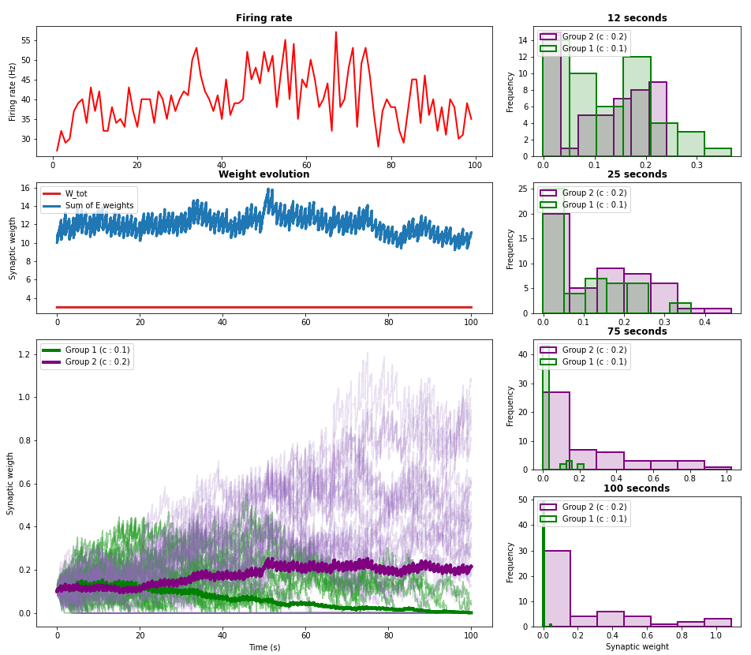

# Results

# Chapter 4

## 4.1 Synaptic Normalization

In this exercise I implemented the homeostatic mechanism of synaptic normalization. Each weight for all excitatory and 
inhibitory synapses is (separately) adjusted every `t_norm` seconds by the following multiplicative rule:

`w(t+1) = w(t)*(1 + eta*(W_tot/sum(w) - 1))`

where `W_tot` is the maximum total allowed weight for the neuron, `sum(w)` is the sum of all (excitatory OR inhibitory) 
weights, and `eta` is the fraction of total change to apply, given the difference between `W_tot` and `sum(w)`.

Such a rule should prevent weigths from growing uncontrollably under STDP.
___

To test whether this is the case, I simulated a LIF neuron receiving 100 excitatory poisson stimuli at 10 Hz. Half of 
those stimuli (Group 1) were correlated with correlation `c1 = 0.1` and the other half (Group 2) were correlated with 
correlation `c2 = 0.2` all the excitatory weights were set to `w_exc = 0.1`. Those weights underwent STDP, with 
`A_ltp_e = 0.02 ` and ` A_ltd_e = -0.01`, as well as underwent synaptic normalization, with `eta = 0.2`. 

Multiple simulations were run, in which both the correlation type (`instantaneous` or `exponential`) and the maximum 
weight (`W_tot`) were varied.

The neuron also received 30 inhibitory poisson inputs, which were uncorrelated, 
and did not undergo neither STDP nor synaptic normalization.

The neuron was simulated for 100 seconds in all experiments. 

### Experiment 1 

Here the correlation was instantaneous (`corr_type = 'inst'`) and `W_tot = 3`.

Because each excitatory weight is initially set to `w_exc = 0.1`, the sum of all `N = 100` excitatory weights (`sum(w) = 10`) 
is much larger than the total allowed weight (`W_tot = 3`). 

Thus, we would expect the neuron to decrease all of its weights in order to bring them down to a more acceptable value. 
This is indeed occurring every time that the weights are normalized (ie: every second). 

However, given the initial synaptic weights, the large number of correlated excitatory inputs, as well 
as the slow normalization time step, we see that _STDP is able to counter-balance the normalization_ by growing the weights just enough
so that the at each normalization step the weights are lowered back by roughly the same amount they were increased by STDP (**mid-left panel**). 

This is reflected by the instantaneous firing rate, which if fairly stable around 40 Hz (**top-left panel**).

 

If we then look at the distribution of excitatory weights over time (**bottom left panel | right panels**), we see an interesting pattern. 
In the first `~20 s`, the two groups of stimuli are equally competing for synaptic resources of the post-synaptic neuron. 

However, as the neuron receives more and more highly-correlated spikes from `Group 2`, the weights for `Group 2` are increased 
faster than those for `Group 1`. This in turn causes the overall normalization factor to increase and, while the weights of 
`Group 2` are able to remain stable (given that the largest contribution to the normalization factor is theirs), the weights
for `Group 1` are not able to grow fast enough to overcome synaptic normalization (on average) and, as time progresses, 
more and more of them are driven to zero.

This shows how synaptic normalization coupled to STDP will lead a neuron to prune away the 'less inportant' (less correlated)
inputs in favor of 'more relevant' (more correlated) inputs, in the biologically realistic case of having limited resources 
to allocate towards synaptic connectivity.

### Experiment 2

Here the correlation was exponential (`corr_type = 'exp'`) and again `W_tot = 3`.

Similarly to Experiment 1, when looking at the weight distributions over time (**bottom-left panel | right panels**) the
two synaptic input groups initially equally compete for synaptic resources until about 12 
seconds, after which `Group 2` takes over `Group 1` and slowly drives it to extinction.

What is interesting to note, however, is that in the case of exponentially correlated inputs, the STDP is not able to 
overcome the synaptic normalization from the beginning. Therefore, we observe an initial decline in firing rate until it 
becomes stabilized at around 10 Hz (**top-left panel**), which is reflected by the stabilization of total excitatory synaptic weights at around 4, 
slightly above the total allowed sum of excitatory weights (**mid-left panel**).

 

### Experiment 3

Here the correlation was instantaneous (`corr_type = 'inst'`) and the allowed sum of weights was increased to `W_tot = 13`.

The idea behind increasing the allowed total weight was that, if the sum of the initial weights was smaller, then the weights would only grow until the maximum is reached and stop. 

This, however was an erroneous idea. In fact, while the sum of weights did indeed grow until `W_tot` was reached, it did not stop growing once it did. Instead it kept increasing until it stabilized at ~35, which lead to a quite high firing rate of ~125 Hz. 

This happened because the initial weights, as in Experiment 1, were already quite high (`sum(w)=10`) and, given that the maximum allowed weight

## 4.2 Intrinsic Plasticity

# Go back to:

[Chapter 1 : Leaky Integrate-and-Fire](https://github.com/rtam97/C11-CompModNeuPlast/blob/main/results/unit1/README.md)

[Chapter 2 : Adaptations in Spiking Behavior](https://github.com/rtam97/C11-CompModNeuPlast/blob/main/results/unit2/README.md)

[Chapter 3 : Spike-Timing Dependent Plasticity](https://github.com/rtam97/C11-CompModNeuPlast/blob/main/results/unit3/README.md)

[Chapter 4: Synaptic Homeostasis](https://github.com/rtam97/C11-CompModNeuPlast/blob/main/results/unit4/README.md)

[Chapter 5: Short-Term Plasticity](https://github.com/rtam97/C11-CompModNeuPlast/blob/main/results/unit5/README.md)
