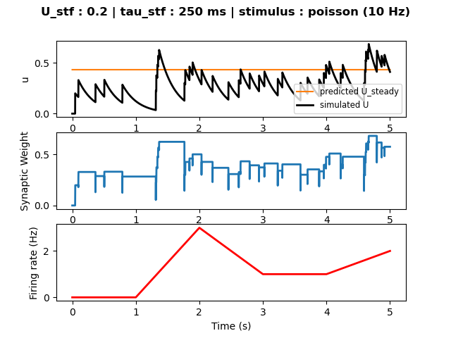
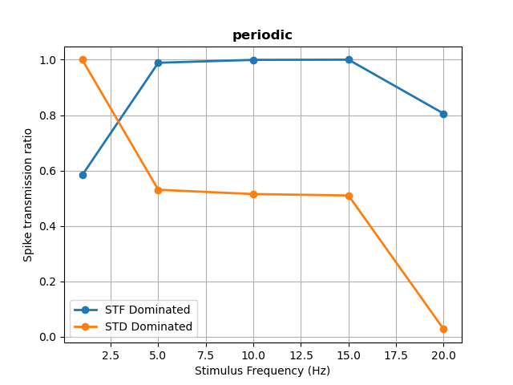

# Results

# Chapter 5 : Short-Term Plasticity

## 5.1 Short Term Facilitation

In this exercise I implemented a mechanism for short term facilitation (STF), as described in [Tsodyks, Pawelzik & Markram (1998)](http://www.ccnss.org/ccn_2014/materials/pdf/tsodyks/Tsodyks_1998.pdf).

Here, STF is modeled phenomenologically as the result of temporary increase of neurotransmitter release probability at the pre-synaptic terminal due to calcium influx after a spike is generated in the pre-synaptic neuron. This probability is captured by the time-dependent variable `u` which obeys the following equation:

`du/dt = -u/tau_stf + U_stf * (1-u) * delta(t-t_spike)`

where `tau_stf` is the STF time constant and `U_stf` is the increase in neurotransmitter release probability due to calcium influx in the pre-synaptic neuron, which is only applied when a pre-synaptic spike occurs (ie: `t-t_spike == 0`).

Every time the pre-synaptic neuron fires an action potential, the synaptic strength between itself and the post synaptic neuron is increased as:

`w_e = w_fixed * u`

where `w_fixed` is a pre-determined increase factor (here set to 'w_fixed = 1').

___

A neuron was simulated for `t_sim = 5000 ms`, receiving `N_e = 10` excitatory inputs, of which half underwent STF, and the others did not. All synaptic weights were set to `w_e = 0.0`. The input rate was set to 'rate = 10 Hz' for all inputs.

The parameters for STF were `U_stf = 0.2`, `w_fixed = 1` and `tau_stf` was varied across experiments   

No STDP, synaptic normalization, or intrinsic plasticity were added.

No inhibitory inputs were added.

___

[Tsodyks, Pawelzik & Markram (1998)](http://www.ccnss.org/ccn_2014/materials/pdf/tsodyks/Tsodyks_1998.pdf) predicted that, for a neuron receiving periodic stimulation with `rate = r`, the neurotransmitter release probability would reach the steady-state value of: 

`U_steady = U_stf / (1 - (1 - U_stf) * exp(-1/(tau_stf*rate)))`

Therefore, I simulated the neuron receiving a `stimtype = 'periodic'` input at a rate of `r = 10 Hz`. Two simulations were performed, in which the time constant was varied between `tau_stf = 750 ms` and `tau_stf = 250 ms`.

The evolution of the neurotransmitter release probability is plotted here, together with the predicted steady-state value. Weight evolution and post-synaptic firing rates are also included. 

 
  
  

It can be observed that in both simulations the steady state value was reached, at which point the optimal weight for keeping the desired firing rate (10 Hz) was found. A faster time constant leads to lower steady-state value, which is reached more rapidly.

___

In a second set of experiments, the same neuron was simulated with the exact same parameters, except that now the input stimuli were `poisson` distributed, without correlation between themselves.

 
  
  

Once again, in both simulations the neurotransmitter release probability `u` reaches the steady state value, although here it varies around it due to the stochastic nature of the pre-synaptic firing.

Interestingly, a shorter time-constant leads the post-synaptic neuron to a lower firing rate than it would achieve given a larger time-constant. This is due to the fact that, with a larger time-constant, the probability of neurotransmitter release decays much more slowly, and therefore when a new pre-synaptic spike occurs, it can be summed on top of the previous one which is still decaying. 

Oppositely, if the probability decays too fast, when spikes occur in a quick sequence, the probability increases do not sum onto each other and therefore the weights are not increased as much, thus lowering the possible firing rate in the post-synaptic neuron.

## 5.2 Short Term Depression

In this exercise short term depression (STD) was added to the simulation. Short term depression is caused by a transient depletion of redily available neurotransmitter at the synaptic terminal. The amount of available neurotransmitter is captured by the time-dependent variable `x(t)`, which evolves according to :

`dx/dt = (1-x)/tau_std - (u*x)*delta(t-t_spike)` 

where `tau_std` is the STD time constant. It can be seen that `x(t)` is also dependant on `u(t)` , which evolves with:

`du/dt = -u/tau_stf + U_stf * (1-u) * delta(t-t_spike)`

Indeed, STP overall is generated by the balanced interaction between STD and STF: different neurons will exhibit different time constants for STD and STF, which in turn will affect how they process incoming pre-synaptic spike trains.

---

 
  
  

When the STF time constant is larger than the STD one (`tau_stf = 750 > tau_std`), the synapse is said to be STF-dominant, or 'facilitating'. When receiving a periodic input, `u(t)` will grow much faster than `x(t)` until saturated, resulting in an increase of synaptic weights. The effect of this is that later incoming spikes will have a higher chance of being transmitted to the post-synaptic neuron. 

The speed at which saturation is reached depends on the pre-synaptic firing rate: a high frequency input will ramp up `u(t)` and thus saturate the weights fairly quickly, so that more spikes will be transmitted to the post-synaptic neuron. In contrast, a low frequency input will take longer to raise the synaptic weights, so less spikes will pass through.

Therefore, an **STF-dominated** neuron will act as a **high-pass filter**.

 
  
  

In contrast, an **STD-dominated** neuron will act as a **low-pass filter**.

This is because, when the STD time constant is larger than the STF one (right figure:_ `tau_stf = 750 > tau_std = 50`), a fast input rate will rapidly decrease neurotransmitter availability (`x(t)`), which in turn will decrease the weight faster, so that less spikes will pass through, while a slow input will take longer to deplete the neurotransmetter and therfore be allowed to pass through more spikes.

This effect can also be seen in the frequency-response curve below:

 
  

---

Similarly, when the inputs to the neuron are not periodic but **poisson-distributed**, a similar effect is obtained, although much less pronounced and regular.

**Facilitating synapse**

 
  
  

**Depressing synapse**

 
  
  

**Frequency response** (averaged across 25 trials)

 
  
  

# Go back to:

[Chapter 1 : Leaky Integrate-and-Fire](https://github.com/rtam97/C11-CompModNeuPlast/blob/main/results/unit1/README.md)

[Chapter 2 : Adaptations in Spiking Behavior](https://github.com/rtam97/C11-CompModNeuPlast/blob/main/results/unit2/README.md)

[Chapter 3 : Spike-Timing Dependent Plasticity](https://github.com/rtam97/C11-CompModNeuPlast/blob/main/results/unit3/README.md)

[Chapter 4: Synaptic Homeostasis](https://github.com/rtam97/C11-CompModNeuPlast/blob/main/results/unit4/README.md)

[Chapter 5: Short-Term Plasticity](https://github.com/rtam97/C11-CompModNeuPlast/blob/main/results/unit5/README.md)
